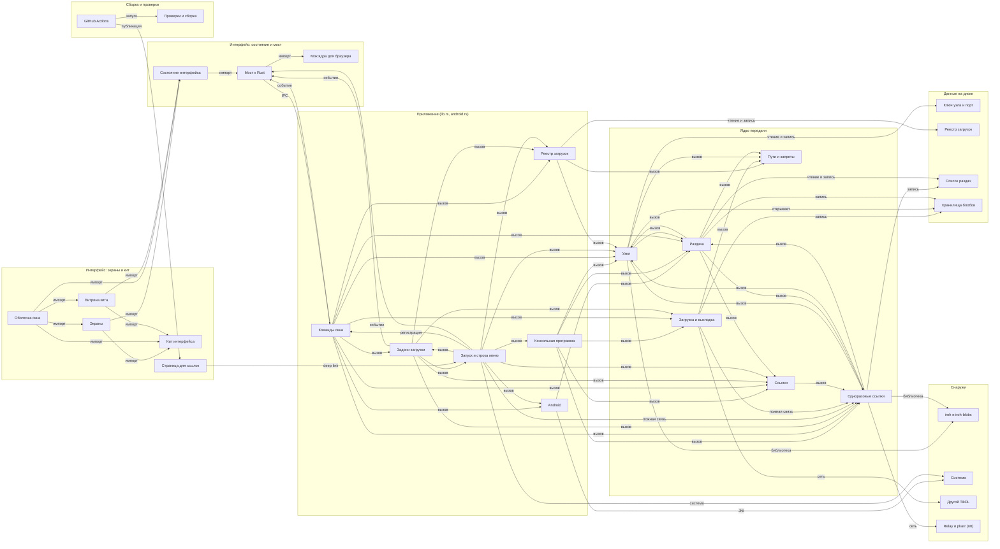

# Карта компонентов (генерируется)

Сгенерировано `node scripts/passport.mjs build` из `passport/components/*.json`. Не править руками.

```mermaid
flowchart LR
  subgraph ui["Интерфейс: экраны и кит"]
    ui_kit["Кит интерфейса"]
    ui_screens["Экраны"]
    ui_shell["Оболочка окна"]
    ui_showcase["Витрина кита"]
    ui_site["Страница для ссылок"]
  end
  subgraph bridge["Интерфейс: состояние и мост"]
    ui_api["Мост к Rust"]
    ui_mock["Мок ядра для браузера"]
    ui_state["Состояние интерфейса"]
  end
  subgraph app["Приложение (lib.rs, android.rs)"]
    app_android["Android"]
    app_cli["Консольная программа"]
    app_commands["Команды окна"]
    app_jobs["Задачи загрузки"]
    app_shell["Запуск и строка меню"]
    app_state["Реестр загрузок"]
  end
  subgraph core["Ядро передачи"]
    core_download["Загрузка и выкладка"]
    core_links["Ссылки"]
    core_node["Узел"]
    core_once["Одноразовые ссылки"]
    core_paths["Пути и запреты"]
    core_share["Раздача"]
  end
  subgraph data["Данные на диске"]
    data_key["Ключ узла и порт"]
    data_registry["Реестр загрузок"]
    data_shares["Список раздач"]
    data_store["Хранилища блобов"]
  end
  subgraph ext["Снаружи"]
    ext_iroh["iroh и iroh-blobs"]
    ext_os["Система"]
    ext_peer["Другой TikDL"]
    ext_relay["Relay и pkarr (n0)"]
  end
  subgraph delivery["Сборка и проверки"]
    delivery_checks["Проверки и сборка"]
    delivery_ci["GitHub Actions"]
  end
  app_android -->|вызов| core_share
  app_android -->|JNI| ext_os
  app_cli -->|вызов| core_node
  app_cli -->|вызов| core_share
  app_cli -->|вызов| core_download
  app_cli -->|вызов| core_links
  app_cli -->|вызов| core_once
  app_commands -->|вызов| app_state
  app_commands -->|вызов| core_node
  app_commands -->|вызов| app_jobs
  app_commands -->|вызов| core_links
  app_commands -->|вызов| core_download
  app_commands -->|вызов| core_share
  app_commands -->|вызов| core_once
  app_commands -->|вызов| app_android
  app_commands -->|событие| ui_api
  app_jobs -->|вызов| app_state
  app_jobs -->|вызов| core_links
  app_jobs -->|вызов| core_download
  app_jobs -->|вызов| core_once
  app_jobs -->|вызов| app_shell
  app_jobs -->|событие| ui_api
  app_shell -->|вызов| app_cli
  app_shell -->|ложная связь| core_once
  app_shell -->|вызов| app_state
  app_shell -->|вызов| app_jobs
  app_shell -->|регистрация| app_commands
  app_shell -->|вызов| app_android
  app_shell -->|вызов| core_node
  app_shell -->|вызов| core_links
  app_shell -->|событие| ui_api
  app_shell -->|система| ext_os
  app_state -->|вызов| core_node
  app_state -->|вызов| core_paths
  app_state -->|чтение и запись| data_registry
  core_download -->|вызов| core_paths
  core_download -->|ложная связь| core_once
  core_download -->|сеть| ext_peer
  core_download -->|запись| data_store
  core_links -->|вызов| core_once
  core_node -->|вызов| core_paths
  core_node -->|вызов| core_share
  core_node -->|вызов| core_once
  core_node -->|библиотека| ext_iroh
  core_node -->|чтение и запись| data_key
  core_node -->|открывает| data_store
  core_once -->|вызов| core_node
  core_once -->|вызов| core_share
  core_once -->|библиотека| ext_iroh
  core_once -->|сеть| ext_relay
  core_once -->|запись| data_shares
  core_share -->|вызов| core_paths
  core_share -->|вызов| core_links
  core_share -->|вызов| core_once
  core_share -->|вызов| core_node
  core_share -->|чтение и запись| data_shares
  core_share -->|запись| data_store
  delivery_ci -->|запуск| delivery_checks
  delivery_ci -->|публикация| ui_site
  ui_api -->|IPC| app_commands
  ui_api -->|импорт| ui_mock
  ui_screens -->|импорт| ui_kit
  ui_screens -->|импорт| ui_state
  ui_shell -->|импорт| ui_kit
  ui_shell -->|импорт| ui_screens
  ui_shell -->|импорт| ui_state
  ui_shell -->|импорт| ui_showcase
  ui_showcase -->|импорт| ui_kit
  ui_showcase -->|импорт| ui_state
  ui_site -->|deep link| app_shell
  ui_state -->|импорт| ui_api
```
